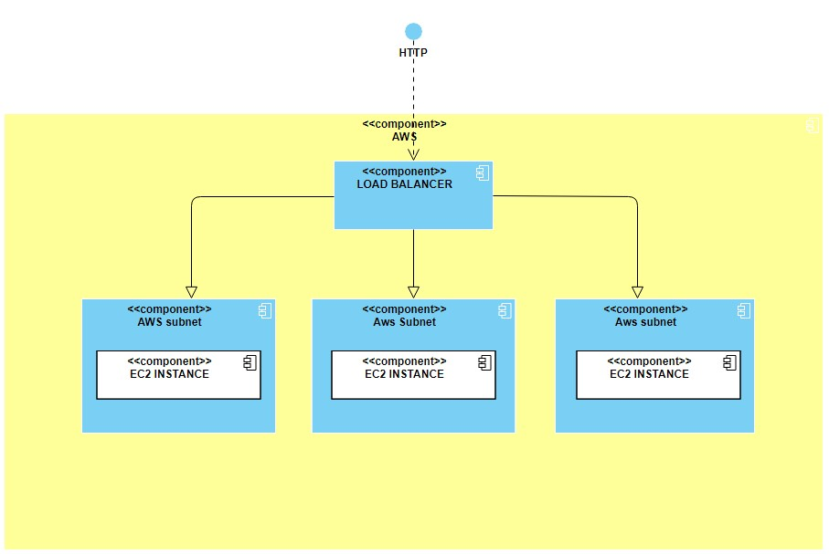
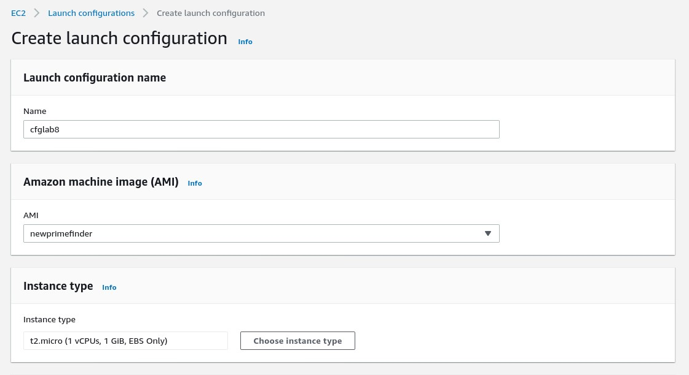
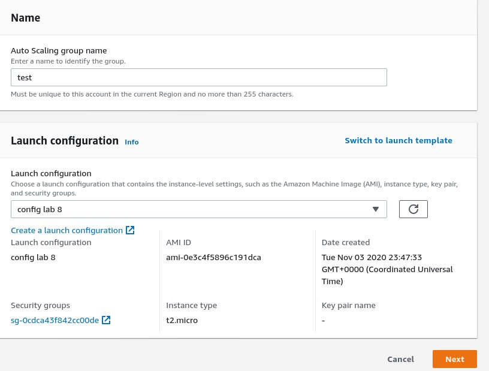
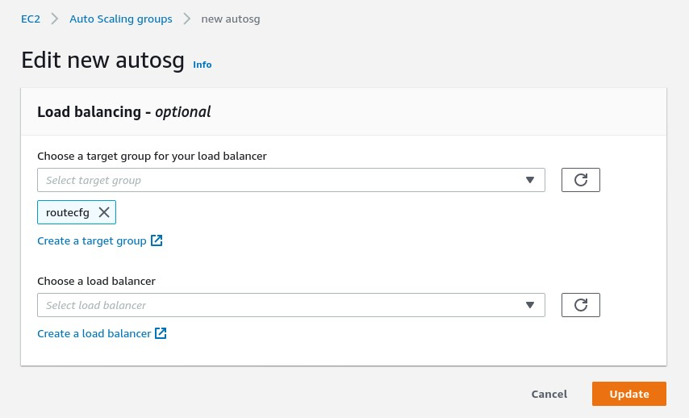
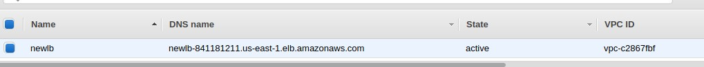
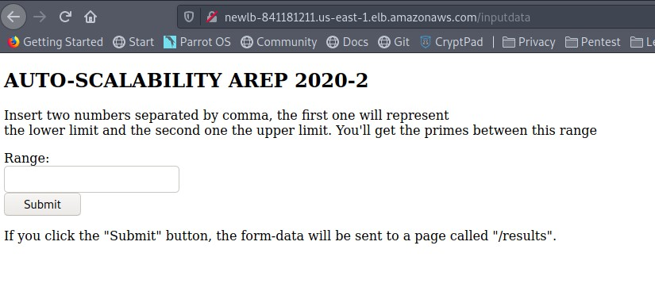
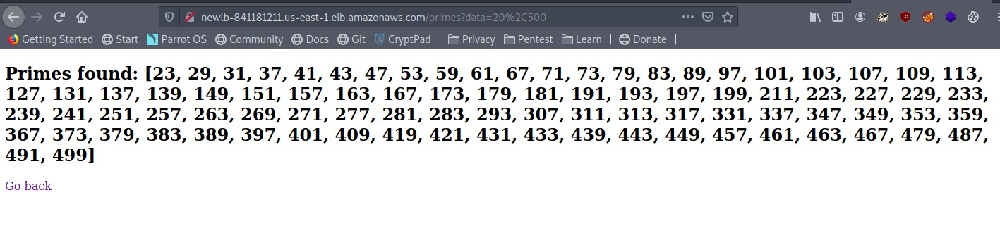

# AutoScalability AREP 2020-2 

## Description

  The main goal of this workshop is to introduce AWS autoscaling technique in order to design secure and stable apps. 
  **Ref**: https://docs.aws.amazon.com/es_es/autoscaling/ec2/userguide/GettingStartedTutorial.html
  For this intro I will use a prime finder app developed in Java.  Primes are used in several routines in information technology, 
  such as public-key cryptography, which relies on the difficulty of factoring large numbers into their prime factors. 
  In abstract algebra, objects that behave in a generalized way like prime numbers include prime elements and prime ideals.
 
## Design 

  This is the intended design for this project
  
  
 
## CI/CD 

This project has continuos integration via 

**CircleCi Prime finder** [](https://app.circleci.com/pipelines/github/JohanS11/AREP_AUTOSCALABILITY)


## User's guide

  In this guide I will explain step-by-step the process to setup an auto-scaling architecture in Amazon Web Services (AWS).
  
  ### Prerequisites
  
  It is necessary having the following in order to setup this project.
  
  * An EC2 instance. I chose Amazon Linux 2 AMI (HVM), SSD Volume Type - ami-0947d2ba12ee1ff75 (64-bit x86) / ami-007a607c4abd192db (64-bit Arm).
  * Docker-compose / Docker / Git installed in the EC2 instance.
 
  ### Setting up this project

1. **Download this docker image**

```sh
  $ docker pull chan1100/primefinder:latest
```
  
2. **Execute the following commands in order to run the code** 

```sh
  $ git clone https://github.com/JohanS11/AREP_AUTOSCALABILITY.git
  $ cd AREP_AUTOSCALABILITY
  $ ./dockerScript.sh
```

3. **Open the port 9001 in the security group of the EC2 instance**

4. **Verify that you have the "restart : always" in your docker-compose.yml file**
    
    This will help us to keep our prime finder service running after a boot in the EC2 instance.
  
5. **Now you should be able to see your app running on the 9001 port**

  ### Setting up the architecture in AWS
 
1. **Create an image from the EC2 instance mentioned above**


2. **Create a launch configuration** 

  Select the image created above, the name of the cfg , the security group , the key pair, and the type of instance.

  
   
3. **Create an AutoScaling Group**


   Set the name and click the ***Switch to launch configuration*** and select the configuration created above
   
   
   
   In the section "Configure settings" select the default VPC and select 3 subnets
   
   

4. **Now we will set the maximum number of instances accepted in the auto scaling process (3 for this intro).**
  **Also we'll set the maximum percentage of use of the CPU, in this case if the cpu exceeds the 50% it will activate a new instance**
  

   
5. **Create a load balancer, it will handle all the requests**

  For this example I chose an application load balancer 
 
  
  
  Note:  Select the same VPC as the autoscalability group and mark the three subnets mentioned above.
  
  
  
  
  
  Configure the routing
  
  

  Review
  
  
 
 
  
6. **Add the load balancer created above to the auto scaling group created before**

     


 ### Testing the Architecture with Postman
  
  **Load Balancer Domain Name Server (DNS)**
  
  
  
  **Input data page**
  
  
  
  **Primes found page**
  
  
  
 ## Charge tests 
 
 
       
  ## This project was built with:
  
   - Apache Maven 3.6.3
   - Docker 
   - Spark web
   - Java 1.8.0_211
   - Git 2.26.2
   - AWS (EC2)
   
  ## Docker Cheat Sheet
  
  ***List all containers***
  
 ```sh
  $ docker container ls 
  $ docker ps -a (List all containers not just running)
```

***List all images***
  
  ```sh
  $ docker images  
```

***Build an image from the Dockerfile***
  
  ```sh
  $ docker build -t <myimage> 
```
***Run a container***

  ```sh
  $ docker run -d -p <localport>:<containerport> --name firstdockercontainer <image> 
```
***Run a docker-compose with 3 instances of web***

```sh
  $ docker-compose up -d --scale web=3
```

***Get a shell into the container***

```sh
  $ docker exec -it <docker ID> /bin/bash
```
[Here is a batch scrip to reset all the stuff :=)](https://github.com/JohanS11/LAB5Arep/blob/master/docker-compose/docker-reset.sh)
  
   
  ## Author
  
  Johan Sebastian Arias Amador ([JohanS11](https://github.com/JohanS11))
  
  ## License
  
  This project is licensed under the GNU General Public License v3.0 - see the [LICENSE](https://github.com/JohanS11/LAB2-AREP/blob/master/LICENSE) file for more details.
